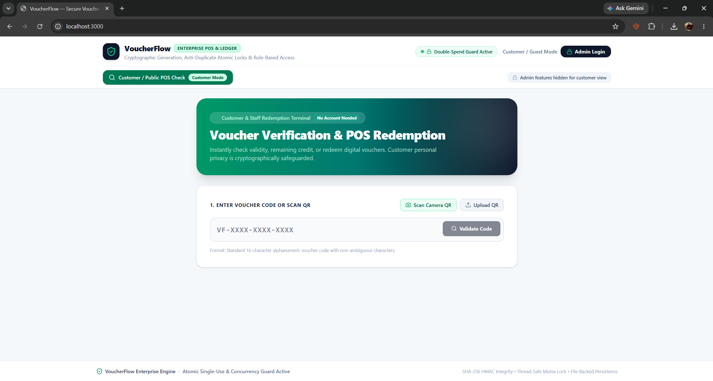

# 🎟️ VoucherFlow

> **A prototype digital voucher management and redemption system built with React, TypeScript, Express, and Firebase.**

VoucherFlow is a full-stack web application prototype that demonstrates the management and redemption of digital vouchers.

The project was built as a **portfolio and learning project** to explore full-stack web development, REST APIs, database integration, authentication, voucher validation, and secure single-use redemption.

> ⚠️ **Prototype Project:** VoucherFlow is **not production-ready** and is not intended to process real customer data, payments, or commercial transactions.

 
---

## ✨ Features

### 🎟️ Voucher Management

- Generate unique voucher codes
- Create fixed-value and percentage-based vouchers
- Set minimum purchase requirements
- Set voucher expiration dates
- View voucher details and status
- Revoke or delete vouchers
- Generate vouchers in bulk
- Track voucher lifecycle

### 🔍 Customer Verification

- Verify voucher codes
- Check voucher validity
- View voucher information
- Check expiration and redemption status
- Calculate applicable voucher discounts
- View digital voucher passes
- Support QR codes and barcodes

### 💳 POS Redemption

- Redeem vouchers through a dedicated POS interface
- Enter or scan voucher codes
- Validate vouchers before redemption
- Check minimum purchase requirements
- Apply the appropriate voucher benefit
- Prevent already-redeemed vouchers from being reused
- Record redemption information
- Support cashier notes and receipt references

### 👨‍💼 Admin Dashboard

- Administrator login
- Voucher registry
- Voucher generation
- Bulk voucher issuance
- Voucher deletion
- Voucher redemption
- Administrator account management
- Audit log viewer
- Dashboard statistics

### 🧪 Concurrency Simulator

- Simulate multiple redemption attempts
- Test single-use voucher behaviour
- Demonstrate concurrent redemption protection
- View successful and rejected redemption attempts
- Demonstrate how race conditions can affect voucher redemption

### 📊 Audit Logging

- Record voucher activity
- Track redemption events
- Track administrative actions
- Record successful and failed operations
- Review recent system activity

---

## 🛠️ Tech Stack

| Technology | Purpose |
|---|---|
| React | Frontend application |
| TypeScript | Type-safe development |
| Vite | Development and build tooling |
| Express | Backend REST API |
| Node.js | Backend runtime |
| Firebase | Backend services |
| Firebase Firestore | Persistent database |
| Tailwind CSS | UI styling |
| Recharts | Dashboard visualisation |
| QRCode | QR code generation |
| JsBarcode | Barcode generation |
| html5-qrcode | QR/barcode scanning |
| Lucide React | UI icons |
| Motion | UI animations |

---

## 🏗️ Architecture

```text
┌──────────────────────────────┐
│       React Frontend         │
│     TypeScript + Vite        │
└──────────────┬───────────────┘
               │
               │ REST API
               ▼
┌──────────────────────────────┐
│       Express Backend        │
│          server.ts           │
├──────────────────────────────┤
│ Authentication               │
│ Voucher API                  │
│ Redemption API               │
│ Admin API                    │
│ Audit API                    │
└──────────────┬───────────────┘
               │
               ▼
┌──────────────────────────────┐
│      Firebase Firestore      │
│           Database           │
└──────────────────────────────┘

## 🚀 Getting Started

### Prerequisites

Make sure you have the following installed:

- [Node.js](https://nodejs.org/)
- npm
- Git
- A Firebase project configured for Firestore

````markdown
### 2. Install Dependencies

```bash
npm install
```

### 3. Configure Firebase

Configure the Firebase settings required by the application.

If the project uses environment variables, create a `.env` file in the project root.

Example:

```env
# Add the Firebase/application environment variables
# required by your local configuration here.
```

> 🔐 **Security:** Never commit real secrets, private keys, passwords, API keys, or other sensitive credentials to GitHub.

### 4. Build the Application

After installing the dependencies, build the application:

```bash
npm run build
```

### 5. Start the Application

Start the application using:

```bash
npm run start
```

The application runs on **port 3000**.

Open the following URL in your browser:

```text
http://localhost:3000
```

> 💡 If port `3000` is already in use, stop the application using that port or configure a different port in the project settings.

---

## 🔑 Default Demo Credentials

VoucherFlow includes a default administrator account for demonstrating the prototype.

| Field | Value |
|---|---|
| **Username / Email** | `admin@voucherflow.com` |
| **Password** | `AdminPass2026!` |

> ⚠️ **Demo credentials only:** These credentials are intended for local development and portfolio demonstrations. They should **never** be used for a production deployment.

If the default administrator account is unavailable after resetting the database, use the administrator account creation functionality to create a new demo account.

---

## 🧑‍💻 Basic Usage

### Administrator

1. Open the application at `http://localhost:3000`.
2. Sign in using the demo administrator credentials.
3. Open the admin dashboard.
4. Generate or manage vouchers.
5. View voucher records and system activity.
6. Use the POS interface to test voucher redemption.
7. Use the concurrency simulator to test simultaneous redemption attempts.

### Customer

1. Open the customer voucher verification interface.
2. Enter a voucher code.
3. Review the voucher's validity and details.
4. View the digital voucher pass when applicable.

### POS Redemption

1. Enter or scan a voucher code.
2. Enter the cart subtotal.
3. Validate the voucher.
4. Confirm the applicable voucher benefit.
5. Redeem the voucher.
6. The voucher should no longer be available for another successful redemption.

---

## 📚 Full Documentation

The detailed technical documentation is maintained separately from this README.

It contains information about:

- System workflows
- Voucher lifecycle
- Customer voucher experience
- Voucher management
- POS redemption
- Concurrency and double-spend protection
- Audit logs and metrics
- Administration
- Security and data integrity
- Screenshots
- Prototype limitations
- Technical implementation concepts

👉 [**Read the full documentation →**](docs/DOCUMENTATION.md)

---

## 📁 Repository Structure

```text
VoucherFlow/
├── screenshots/
├── src/
├── server.ts
├── package.json
├── tsconfig.json
├── vite.config.ts
├── .env
├── .gitignore
├── README.md
└── DOCUMENTATION.md
```

> The exact project structure may vary depending on the current development version.

---

## ⚠️ Prototype Disclaimer

VoucherFlow is a **prototype / portfolio project** created for educational and demonstration purposes.

It has **not** been hardened for production use and should not be used to process:

- Real customer information
- Real payments
- Production financial transactions
- Sensitive authentication credentials
- Commercial voucher programs

A production implementation would require additional security controls, authentication and authorization hardening, comprehensive testing, monitoring, infrastructure configuration, and appropriate compliance measures.

---

## 🎯 Project Goal

VoucherFlow was created to demonstrate how a modern full-stack application can combine:

- React
- TypeScript
- Express
- Firebase Firestore
- REST APIs
- Voucher validation
- POS redemption
- Audit logging
- QR and barcode technologies
- Single-use voucher management
- Concurrency protection

The project is primarily intended to demonstrate **software engineering concepts and full-stack development skills** through a realistic voucher-management use case.

---

## 📌 Project Status

**Status:** 🧪 Prototype / Portfolio Project

VoucherFlow is actively being developed as a technical demonstration and learning project.

> **Not production-ready.**

