# VoucherFlow Documentation

VoucherFlow is a prototype enterprise voucher management and POS redemption platform designed to demonstrate secure voucher issuance, validation, single-use redemption, concurrency protection, and administrative auditability.

> **Project status:** Prototype / portfolio project.  
> VoucherFlow is not intended for production financial or payment processing.

---

## Table of Contents

- [System Overview](#system-overview)
- [Core Workflow](#core-workflow)
- [Customer & Voucher Experience](#customer--voucher-experience)
- [Voucher Management](#voucher-management)
- [POS Redemption](#pos-redemption)
- [Concurrency & Double-Spend Protection](#concurrency--double-spend-protection)
- [Audit Logs & Metrics](#audit-logs--metrics)
- [Administration](#administration)
- [Security & Data Integrity](#security--data-integrity)
- [Technology](#technology)
- [Screenshots](#screenshots)
- [Prototype Limitations](#prototype-limitations)

---

# System Overview

VoucherFlow provides an end-to-end workflow for creating and managing digital vouchers.

The system covers:

1. Voucher generation
2. Persistent storage
3. Customer voucher verification
4. Digital voucher presentation
5. POS validation
6. Single-use redemption
7. Concurrent redemption protection
8. Audit logging
9. Administrative management

The main design goal is to demonstrate how a voucher system can protect against invalid, expired, duplicate, and concurrent redemption attempts.

---

# Core Workflow

```text
┌─────────────────────┐
│ Voucher Generation  │
└──────────┬──────────┘
           │
           ▼
┌─────────────────────┐
│ Firestore Storage   │
│ + Integrity Hash    │
└──────────┬──────────┘
           │
           ▼
┌─────────────────────┐
│ Customer / POS      │
│ Voucher Validation  │
└──────────┬──────────┘
           │
           ▼
┌─────────────────────┐
│ Redemption Request  │
└──────────┬──────────┘
           │
           ▼
┌────────────────────────────┐
│ Atomic / Mutex Protection  │
└──────────┬─────────────────┘
           │
       ┌───┴────┐
       ▼        ▼
   First     Duplicate
   Request    Request
       │        │
       ▼        ▼
  REDEEMED   BLOCKED
       │        │
       └───┬────┘
           ▼
┌─────────────────────┐
│ Immutable Audit Log │
└─────────────────────┘
```

---

# Customer & Voucher Experience

## 1. Customer Voucher Verification

The customer-facing verification workflow allows a voucher code to be checked before redemption.


### Purpose

- Check voucher validity
- Confirm current voucher status
- Display relevant voucher information
- Prevent invalid or previously redeemed vouchers from being accepted

---

## 2. Voucher Details

The voucher detail interface displays the complete voucher document and its associated metadata.

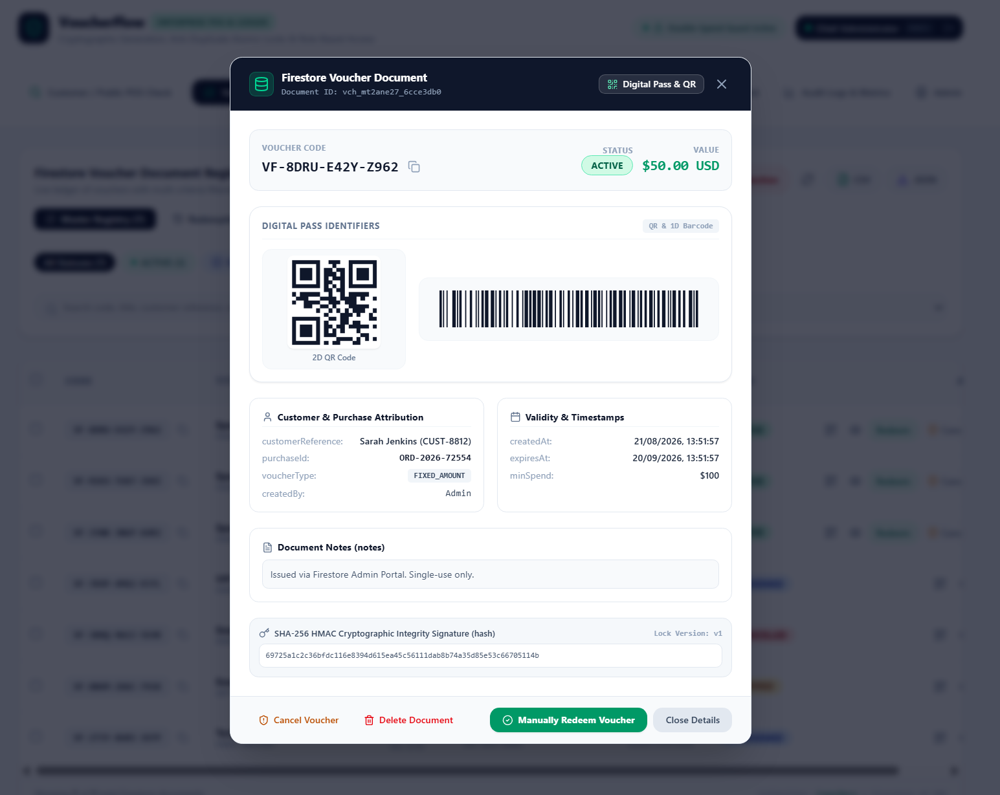

Information can include:

- Voucher code
- Voucher status
- Voucher value
- Currency
- Customer reference
- Purchase/order ID
- Voucher type
- Creation timestamp
- Expiration timestamp
- Minimum spend
- QR code
- Barcode
- Integrity signature
- Voucher notes

This provides administrators with a complete view of an individual voucher's lifecycle.

---

## 3. Digital Pass

VoucherFlow provides a digital pass representation for customers.

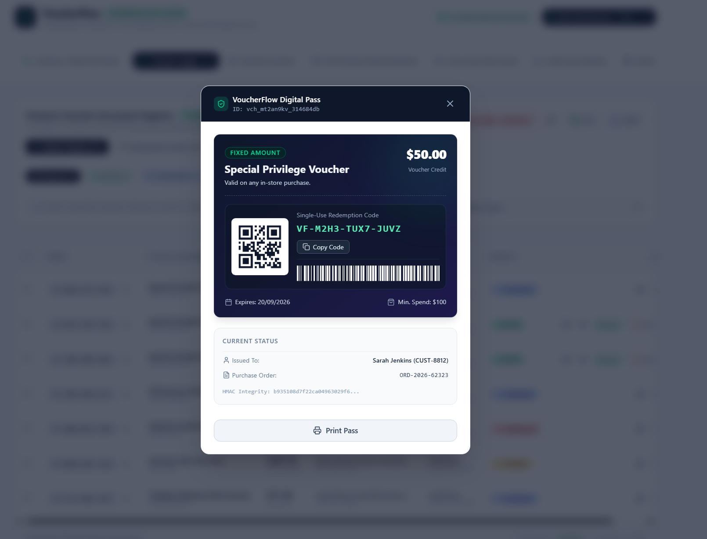

The digital pass presents the voucher in a customer-friendly format and includes machine-readable redemption identifiers.

The pass can contain:

- Voucher value
- Voucher title
- Voucher code
- QR code
- Barcode
- Expiration date
- Minimum spend
- Customer reference

---

# Voucher Management

## 4. Voucher Ledger

The voucher ledger provides an overview of issued voucher documents and their lifecycle status.

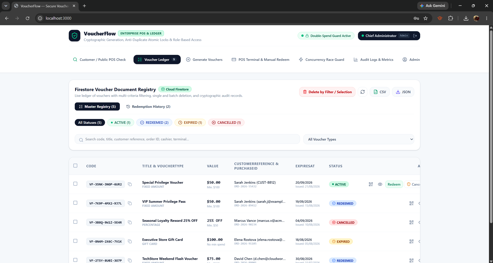

The ledger is intended to provide administrators with a central location for monitoring voucher records.

Typical lifecycle states include:

- Active
- Redeemed
- Expired
- Revoked

---

## 5. Voucher Generation

Administrators can generate individual vouchers using different voucher types.

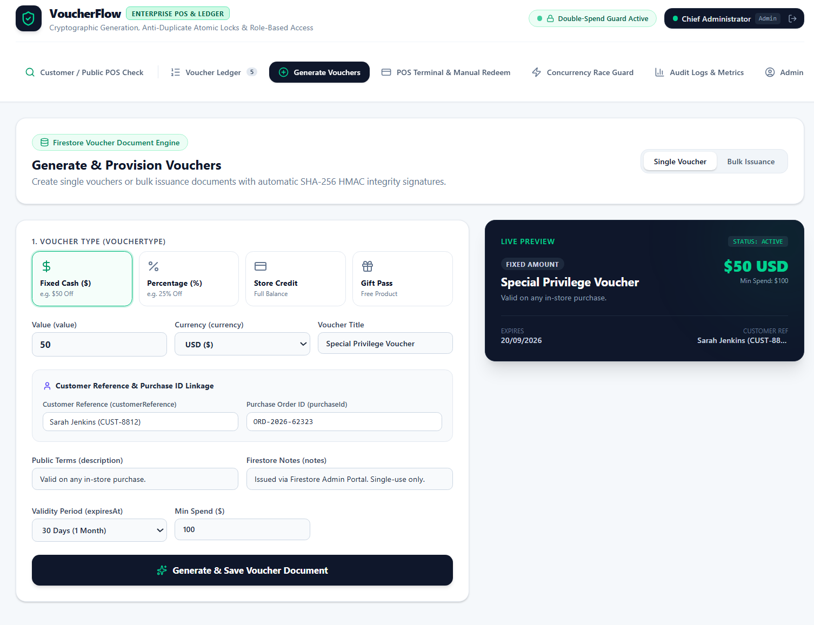

Supported voucher concepts include:

- Fixed amount
- Percentage discount
- Store credit
- Gift pass

Voucher generation can include:

- Value
- Currency
- Voucher title
- Customer reference
- Purchase ID
- Public terms
- Internal notes
- Expiration period
- Minimum spend

Each generated voucher is assigned a unique identifier and redemption code.

---

## 6. Bulk Voucher Issuance

VoucherFlow also supports bulk voucher generation.

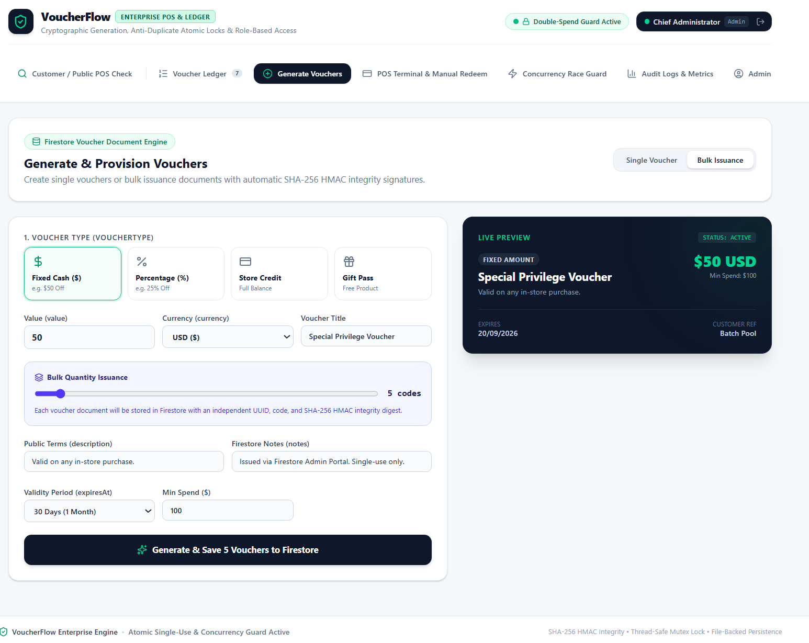

Bulk issuance allows administrators to generate multiple voucher documents from a single configuration.

Each generated voucher is intended to receive its own:

- Unique document ID
- Voucher code
- Persistence record
- Integrity signature

This is useful for campaigns, promotions, and batch voucher distribution.

---

## 7. Bulk Voucher Deletion

Administrative voucher management also includes bulk deletion capabilities.

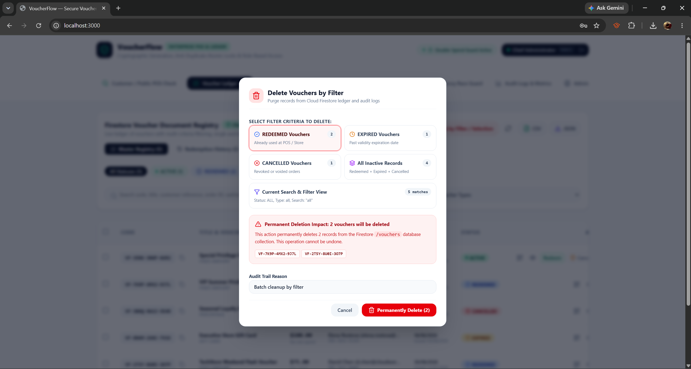

This provides administrators with a way to manage unwanted or test voucher records during development.

---

# POS Redemption

## 8. POS Terminal & Manual Redemption

The POS terminal provides the operational interface used to validate and redeem a voucher.

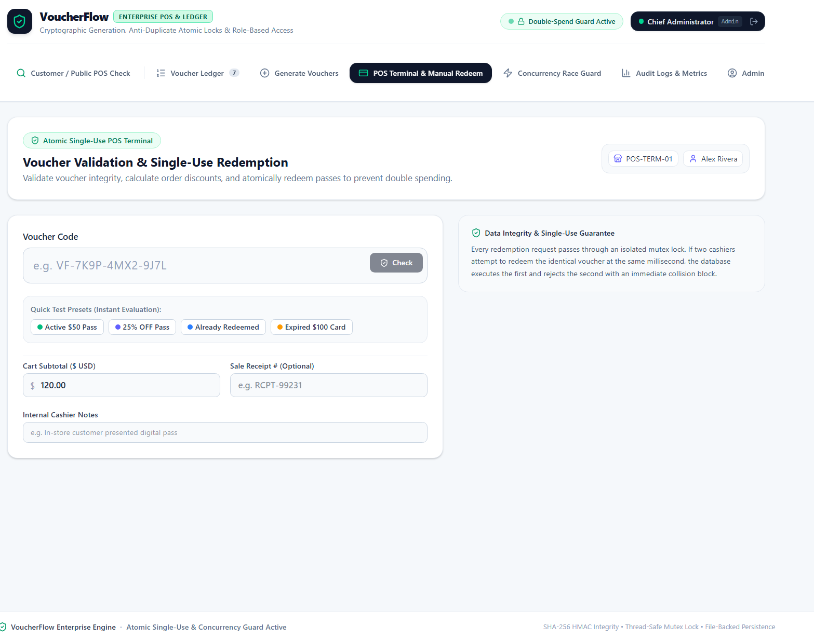

The workflow is designed around:

1. Entering or scanning a voucher code
2. Validating the voucher
3. Checking the cart subtotal
4. Applying the appropriate voucher benefit
5. Recording the redemption
6. Preventing subsequent use of the same voucher

The interface also supports cashier notes and an optional sales receipt reference.

### Minimum Spend

Where configured, the voucher's minimum spend is checked against the cart subtotal before redemption.

For example:

```text
Voucher Value:     $50
Minimum Spend:    $100
Cart Subtotal:    $120

Result: Voucher eligible for redemption
```

---

# Concurrency & Double-Spend Protection

## 9. Concurrency Race Condition Test

One of the core technical demonstrations in VoucherFlow is the concurrent redemption test.

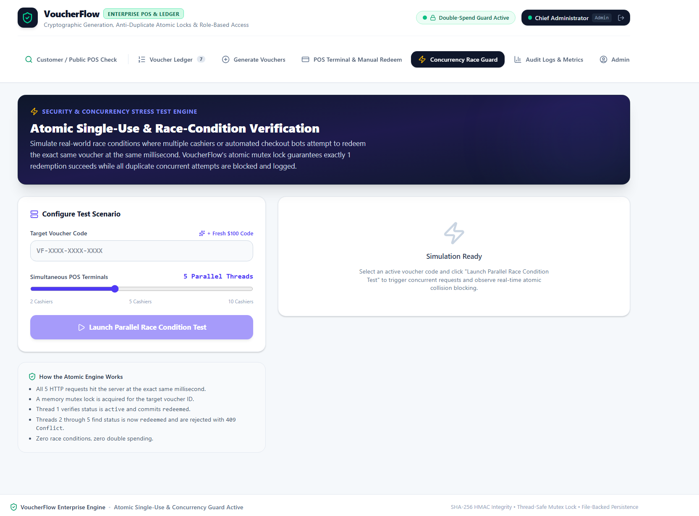

The test simulates multiple POS terminals attempting to redeem the same voucher at approximately the same time.

### Example

```text
Voucher: VF-XXXX-XXXX-XXXX

             ┌─────────────┐
POS 1 ──────►│             │
POS 2 ──────►│ Atomic Lock │
POS 3 ──────►│             │
POS 4 ──────►│             │
POS 5 ──────►│             │
             └──────┬──────┘
                    │
             ┌──────┴──────┐
             │             │
             ▼             ▼
          Request 1    Requests 2–5
             │             │
             ▼             ▼
          REDEEMED       BLOCKED
```

The intended result is:

- Exactly one redemption succeeds.
- Concurrent duplicate attempts are rejected.
- The voucher cannot be redeemed multiple times because of a race condition.
- Collision attempts are recorded for auditing.

### Why This Matters

A simple implementation such as:

```text
check status
      ↓
if active:
      ↓
redeem
```

can be vulnerable when two requests execute at nearly the same time.

VoucherFlow therefore demonstrates a protected redemption path where the voucher state transition is guarded against concurrent access.

---

# Audit Logs & Metrics

## 10. Audit Logs & Metrics

VoucherFlow records operational events for voucher generation, validation, redemption, and blocked collisions.

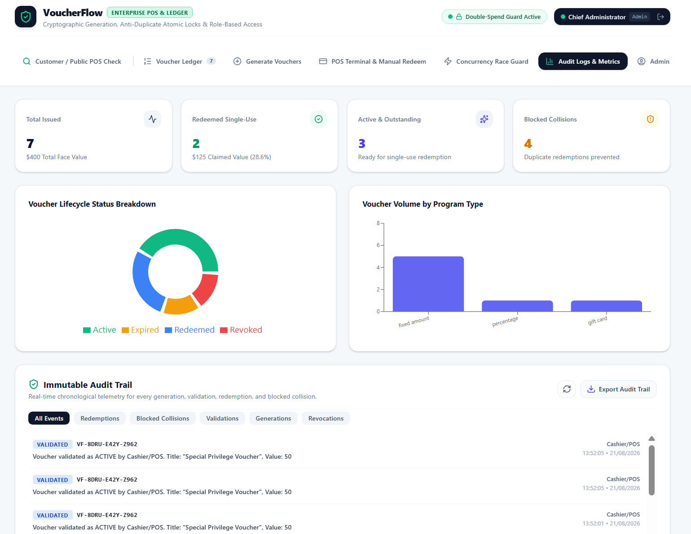

The dashboard provides visibility into:

- Total issued vouchers
- Redeemed vouchers
- Active/outstanding vouchers
- Blocked duplicate redemption attempts
- Voucher lifecycle status
- Voucher volume by program type
- Chronological audit events

### Audit Trail

The audit trail is intended to provide a chronological record of important voucher events.

Example event categories include:

- Generation
- Validation
- Redemption
- Blocked collision
- Revocation

This allows administrators to understand what happened to a voucher and when.

---

# Administration

## 11. Administrator Dashboard

The administration area provides protected access to VoucherFlow's management functions.

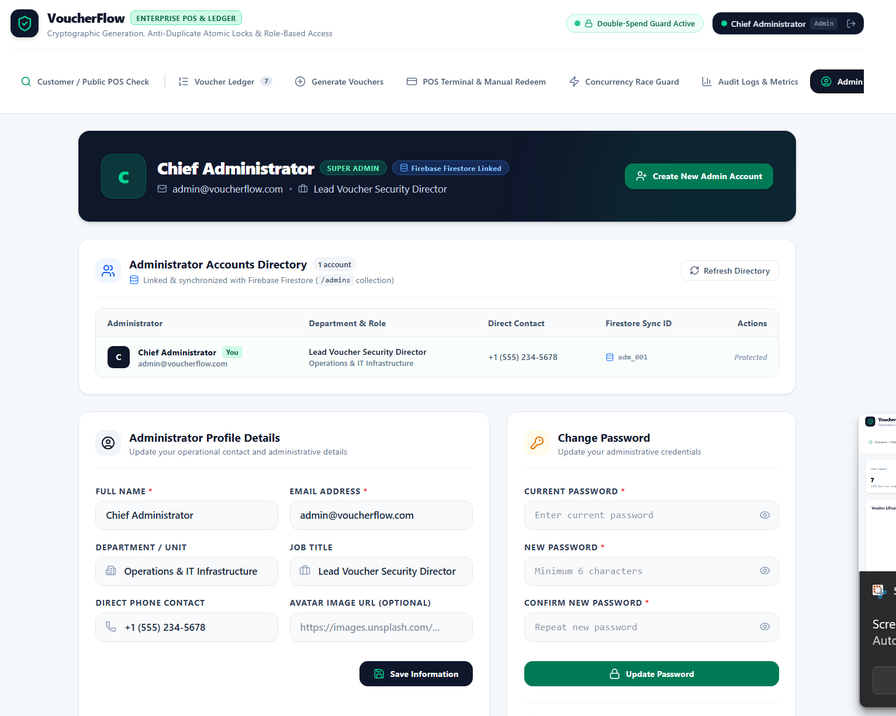

The administrator area can be used to manage:

- Administrator accounts
- Operational details
- Administrative credentials
- Voucher system configuration

The interface also identifies the active administrator and their role.

---

## 12. Create Administrator Account

VoucherFlow includes an administrator account provisioning workflow.

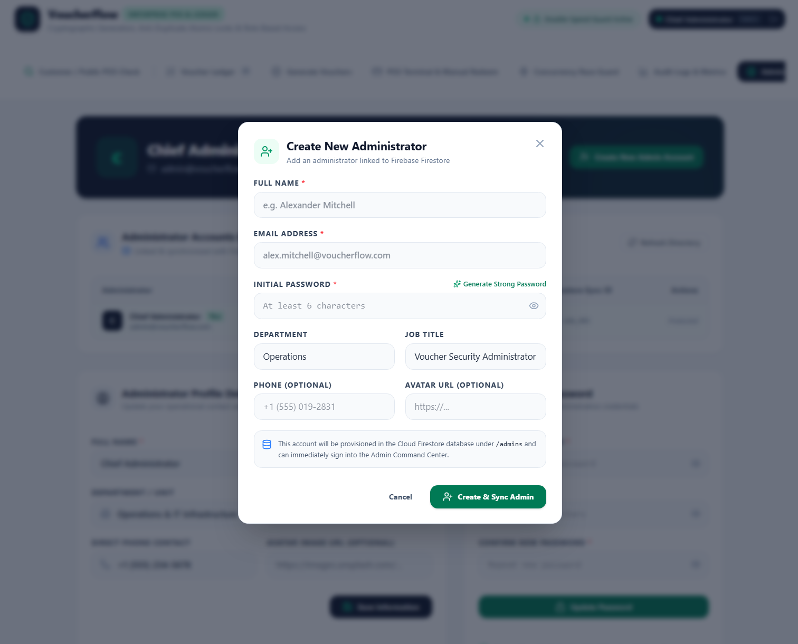

The administrator creation form includes fields for:

- Full name
- Email address
- Initial password
- Department
- Job title
- Phone number
- Avatar URL

New administrator records are designed to be synchronized with the Firestore `/admins` collection.

---

## 13. Administrator Authentication

The authentication workflow protects access to administrative functionality.

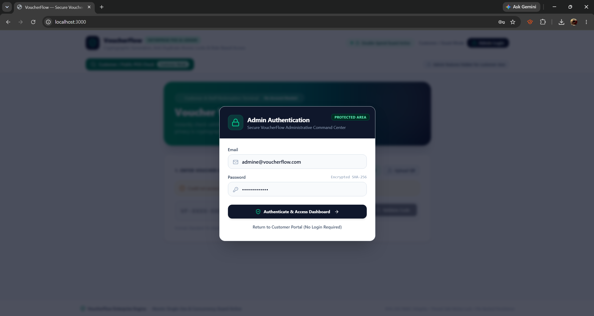

The intended architecture separates customer-facing voucher verification from privileged administrative operations.

Administrative functionality should only be accessible to authenticated and authorized users.

---

# Security & Data Integrity

VoucherFlow was designed with several security and reliability concepts in mind.

## Unique Voucher Codes

Voucher codes are generated with a restricted character set to reduce ambiguity and improve readability.

## Single-Use Redemption

Once successfully redeemed, a voucher transitions away from its active state and cannot be successfully redeemed again.

## Concurrent Redemption Protection

The redemption workflow uses locking/atomic protection concepts to prevent two simultaneous requests from both successfully redeeming the same voucher.

## HMAC Integrity

Voucher documents include a SHA-256 HMAC integrity signature.

The signature is intended to provide a mechanism for detecting unauthorized modification of voucher data.

Conceptually:

```text
Voucher Data
     │
     ▼
HMAC-SHA-256
     │
     ▼
Integrity Signature
```

When voucher information is later validated, the integrity signature can be used to determine whether the protected data has changed.

## Persistent Storage

Voucher and administrative records are persisted using Firebase Firestore.

The application separates persistent voucher state from the presentation layer so that voucher lifecycle information can survive application refreshes and sessions.

---

# Technology

The prototype uses the following technologies and concepts:

| Technology / Concept | Purpose |
|---|---|
| React | User interface |
| TypeScript | Application logic and type safety |
| Firebase | Backend services |
| Firestore | Persistent voucher and administrator data |
| SHA-256 HMAC | Data integrity verification |
| QR Codes | Machine-readable voucher identification |
| Barcodes | POS-friendly voucher identification |
| Atomic / Mutex Locking | Concurrent redemption protection |
| Audit Logging | Operational traceability |

---

# Screenshots

The complete screenshot collection is available in the [`screenshots`](screenshots/) directory.

| # | Screen | File |
|---|---|---|
| 01 | Customer Voucher Verification | `01-customer-voucher-verification.png` |
| 02 | Admin Authentication | `02-admin-authentication.png` |
| 03 | Voucher Ledger | `03-voucher-ledger.png` |
| 04 | Bulk Voucher Deletion | `04-bulk-voucher-deletion.png` |
| 05 | Voucher Details | `05-voucher-details.png` |
| 06 | Digital Pass | `06-digital-pass.png` |
| 07 | Voucher Generation | `07-0-generate-vouchers.png` |
| 07.1 | Bulk Voucher Issuance | `07-1-bulk-voucher-issuance.png` |
| 08 | POS Terminal & Manual Redemption | `08-pos-terminal-manual-redeem.png` |
| 09 | Concurrency Race Condition | `09-concurrency-race-condition.png` |
| 10 | Audit Logs & Metrics | `10-audit-logs-metrics.png` |
| 11 | Admin Dashboard | `11-admin-dashboard.png` |
| 12 | Create Admin Account | `12-create-admin-account.png` |

---

# Prototype Limitations

VoucherFlow is currently a prototype created to demonstrate application architecture, security concepts, and voucher lifecycle management.

Before production deployment, additional engineering work would be required, including:

- Production-grade authentication and authorization
- Secure server-side secret management
- Comprehensive automated testing
- Security review and penetration testing
- Stronger Firestore security rules
- Transactional guarantees appropriate to the production backend
- Rate limiting and abuse protection
- Production monitoring and alerting
- Secret/key rotation
- PCI/payment compliance considerations where applicable
- Formal disaster recovery and backup procedures
- Privacy and data retention controls

The prototype should therefore be treated as a technical demonstration rather than a production payment or financial system.

---

# Project Goal

VoucherFlow was built to explore how a voucher platform can combine a modern web interface with persistent storage, cryptographic integrity, POS workflows, auditability, and concurrency-safe single-use redemption.

The most important technical concept demonstrated by the project is:

> **A voucher redemption system must remain correct even when multiple redemption requests arrive at nearly the same time.**
